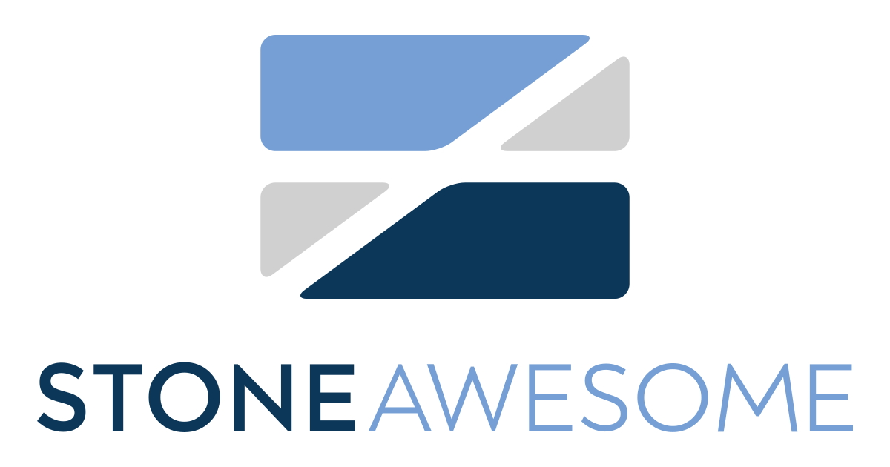

This is the code & content for StoneAwesome. It's based on the [Next.js blogging template](https://github.com/wutali/nextjs-netlify-blog-template).

# Dependencies

- [Next.JS](https://nextjs.org/) - Site is statically generated using Next.JS.
- [Bootstrap](https://getbootstrap.com/) - Most of the main CSS is provided by a customized version of Bootstrap 5.
- [Cloudinary](https://cloudinary.com/) - Persists all of our instagram images allowing us to easily blur, resize and optimize for different screen sizes.
- [FontAwesome](https://fontawesome.com/) - There's several places where we use glyphs. These are almost always provided by FontAwesome. Note we use the DuoTone glyphs and some pro glyphs so you'll need to have a pro account in order to use them, but you can easily swap them out for the free variants.
